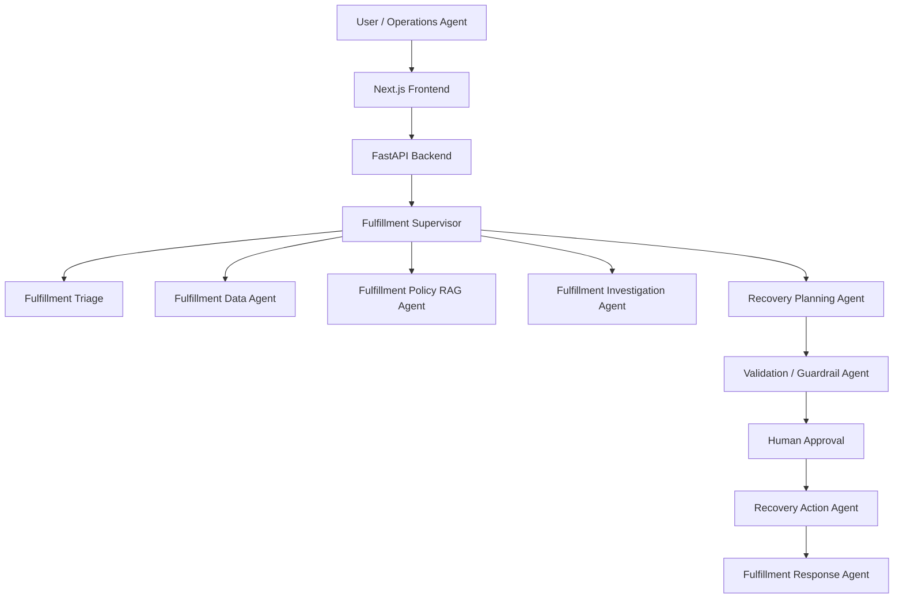
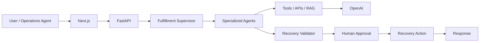

# Agentic Fulfillment Recovery Planner

## Overview

The Agentic Fulfillment Recovery Planner is a production-style, multi-agent fulfillment operations assistant built to investigate delayed, lost, or damaged orders, ground recommendations in policy and operational data, and orchestrate human approvals before consequential actions are executed.

## Business Problem

Modern e-commerce operations must investigate fulfillment exceptions across inventory, warehouse, order, and carrier systems. This system reduces resolution time and improves consistency by combining operational retrieval, policy-aware reasoning, and explicit approval gates for sensitive actions.

## Features

- Multi-agent workflow using LangGraph
- Specialized triage, data retrieval, policy RAG, investigation, planning, validation, and response agents
- Retrieval of order, shipment, inventory, warehouse, and customer data
- Chroma-backed policy search with grounded citations
- Human approval for consequential recovery actions
- Synthetic local dataset for testing and demos
- FastAPI backend, Next.js UI, Docker support, and deployment-ready design

## Architecture



## Multi-Agent Architecture

- Fulfillment Supervisor: routes workflow and decides when more evidence or approval is needed
- Fulfillment Triage Agent: classifies the issue and extracts key entities
- Fulfillment Data Agent: retrieves order, inventory, warehouse, shipment, and carrier facts
- Fulfillment Policy RAG Agent: searches policy and SOP knowledge using Chroma
- Fulfillment Investigation Agent: combines operational + policy evidence and identifies likely root cause
- Recovery Planning Agent: creates grounded action plans
- Recovery Validation Agent: checks evidence, grounding, confidence, and policy compliance
- Human Approval Agent: pauses for review of consequential actions
- Fulfillment Response Agent: produces the final user-facing answer

## Technology Stack

- Frontend: Next.js, TypeScript, Tailwind CSS
- Backend: FastAPI, Pydantic
- Agent system: LangChain, LangGraph
- LLM: OpenAI API with environment configuration
- RAG: ChromaDB, chunking, metadata filtering, retrieval
- Data: SQLite for local development, PostgreSQL-ready schema
- Caching/state: Redis-ready session and workflow state
- Testing: pytest
- Deployment: Docker, Vercel frontend, cloud-ready backend

## RAG Architecture


## LangGraph Workflow

This project uses a typed shared state and conditional graph routing. The workflow runs through triage, supervisor routing, data retrieval, policy retrieval, investigation, recovery planning, validation, optional approval, and final response.

## Folder Structure

```text
.
├── backend/
│   ├── app/
│   │   ├── agents/
│   │   ├── api/
│   │   ├── data/
│   │   ├── graph/
│   │   ├── prompts/
│   │   ├── rag/
│   │   ├── services/
│   │   ├── tools/
│   │   ├── config.py
│   │   ├── main.py
│   │   └── schemas.py
│   └── tests/
├── frontend/
├── Dockerfile
├── docker-compose.yml
├── .env.example
├── .gitignore
├── requirements.txt
├── README.md
└── ...
```

## Installation

1. Clone the repository.
2. Create a Python environment and install dependencies.
3. Copy `.env.example` to `.env` and set your environment variables.
4. Start the backend with Uvicorn.
5. Start the frontend with Next.js.

## Environment Variables

```bash
OPENAI_API_KEY=your_openai_api_key_here
OPENAI_MODEL=gpt-4o-mini
DATABASE_URL=sqlite:///./fulfillment.db
REDIS_URL=redis://localhost:6379/0
CHROMA_PERSIST_DIRECTORY=./backend/app/data/chroma
NEXT_PUBLIC_API_URL=http://localhost:8000
APP_ENV=development
```

## Running Locally

Backend:

```bash
cd /workspaces/Agentic_Fulfillment_Recovery_Planner
python -m venv .venv
source .venv/bin/activate
pip install -r requirements.txt
uvicorn backend.app.main:app --reload --host 0.0.0.0 --port 8000
```

Frontend:

```bash
cd frontend
npm install
npm run dev
```

## API Documentation

The backend exposes a FastAPI API with endpoints such as:

- POST /api/chat
- POST /api/agent/run
- POST /api/documents/ingest
- GET /api/sessions/{session_id}
- GET /api/workflows/{workflow_id}
- POST /api/approval/{workflow_id}
- GET /api/orders/{order_id}
- GET /api/health
- GET /api/metrics

## Sample Requests

```bash
curl -X POST http://localhost:8000/api/chat \
  -H "Content-Type: application/json" \
  -d '{
    "user_query": "Order ORD123 was supposed to arrive yesterday but it has not arrived. What should we do?",
    "order_id": "ORD123",
    "user_id": "ops-user"
  }'
```

## Testing

```bash
cd /workspaces/Agentic_Fulfillment_Recovery_Planner
pytest backend/tests/test_api.py -q
```

## Evaluation

The repository includes an evaluation-ready structure for normal, ambiguous, missing-information, tool-failure, adversarial, policy-conflict, and human-approval scenarios. The backend and agents are designed to be evaluated using a dataset that measures classification accuracy, retrieval relevance, groundedness, policy compliance, and human escalation correctness.

## Docker

```bash
docker compose up --build
```

## Deployment

The frontend and backend are deployed as separate Vercel projects:

- Frontend: `frontend` directory; `NEXT_PUBLIC_API_URL` points to the backend project.
- Backend: repository root; Vercel uses `backend.app.main:app` from `pyproject.toml` and dependencies from `uv.lock`.
- Frontend URL: https://frontend-three-sooty-50.vercel.app
- Backend URL: https://agentic-fulfillment-recovery-planne.vercel.app

Deploy manually with `npx vercel --prod` from `frontend/` for the UI and from the repository root for the API. Git-based automatic deployments are not configured because Vercel could not connect to the GitHub repository. The working tree now includes Clerk verification and PostgreSQL-backed session storage; the current live deployments remain behind SSO while those changes and the internal data adapter are configured.

### Production Configuration

The current Vercel deployments are protected by Vercel SSO while production configuration is being completed. Configure these environment variables before removing that protection:

- Backend: `APP_ENV=production`, a PostgreSQL `DATABASE_URL`, `CLERK_ISSUER`, `CLERK_JWKS_URL`, `CLERK_APPROVER_ROLES`, and `FRONTEND_ORIGIN`.
- Frontend: `NEXT_PUBLIC_CLERK_PUBLISHABLE_KEY` and `NEXT_PUBLIC_API_URL`.
- Fulfillment data: implement and configure the internal API adapter. Production chat/order routes deliberately return `503` rather than use synthetic records until that integration is complete.

Never commit database credentials or identity-provider secrets. Add them through the Vercel project environment settings. The API health endpoint is public; operational endpoints require a valid Clerk bearer token. Recovery plans remain pending until an authorized Clerk organization role records a decision. Recording a decision does not execute carrier, refund, replacement, or inventory actions; those require the internal API adapter and explicit action safeguards.

## Limitations

This repository is structured as a production-style starter implementation and includes realistic synthetic data, tools, and workflow logic. It is intentionally practical rather than a full enterprise deployment stack. Additional production operational hardening, authentication, persistence, and production-grade monitoring would be added in a larger-scale rollout.

## Future Enhancements

- PostgreSQL schema and migration tooling
- Redis-backed session persistence
- Real ChromaDB ingestion workflows and reranking
- Production authentication and RBAC
- OpenTelemetry and LangSmith traces
- More advanced evaluation dashboards
- Expanded operational tool integrations and warehouse systems

## Mermaid System Architecture


